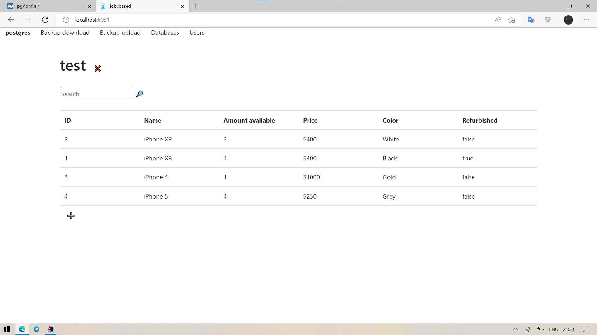

# ```jdbcbased-bd```

UI and server for accessing PostgreSQL using JDBC

All operations performed with SQL functions. Some of them use
dblink from PostgreSQL Pro. All used functions and scripts
for them could be found in folder
[scripts](./backend/src/main/resources/scripts).

## Screenshots

### Operations with items



Main page with filled data


Adding new item


Editing item


Removing item


Search and delete by query

### Operations with databases


List of databases (displays only databases with 'jdbc_' prefix)


Adding new database


New database have needed tables and columns


Deleting database

### User management


User 'Chad' does not have access to table 'public' in database 'jdbc_test'


And Chad does not have access to database 'jdbc_test2'


We can create new user - superuser or casual. Superuser will have full access
to current database, casual will have read-only access to current database


We created new superuser 'new_pro' and they cleaned table

### Backups


Backups in CSV and XLSX

Uploading backups not working since there are problems with requests